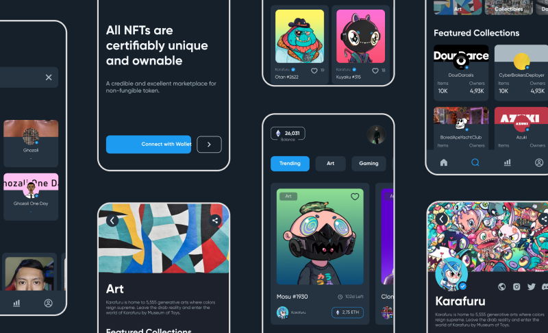

# Enefte \[Slicing\]



## Description

Slicing design using React Native

## Data

This application uses dummy data stored in the `src/data` folder.

## Dependencies

This app is built with some additional packages:

- [x] [@react-navigation/native-stack: 6.9.14](https://reactnavigation.org/docs/native-stack-navigator)
- [x] [@react-navigation/bottom-tabs: 6.5.9](https://reactnavigation.org/docs/bottom-tab-navigator)
- [x] [react-native-svg: 13.14.0](https://www.npmjs.com/package/react-native-svg)
- [x] [react-native-tab-view: 3.5.2](https://reactnavigation.org/docs/tab-view/)

## Development

If you want to try to do the development process, make sure you have setup [React Native](https://reactnative.dev/docs/environment-setup?guide=quickstart) on your device.

You can download this repository by clicking `<> Code` at the top, then selecting `Download ZIP` or if you want to clone this repository you can do this by

```bash
git clone https://github.com/fajarhidayatt/enefte.git
```

After that, install all the packages / dependencies contained in this project

```bash
npm install
```

Then run the application

```bash
npm start
```

## Design

The design used in this application is from [Hub Academy](https://www.figma.com/@hubacademy) in Figma Community.

[enefte - NFT Marketplace](https://www.figma.com/community/file/1085873369515597265/enefte-nft-marketplace)
